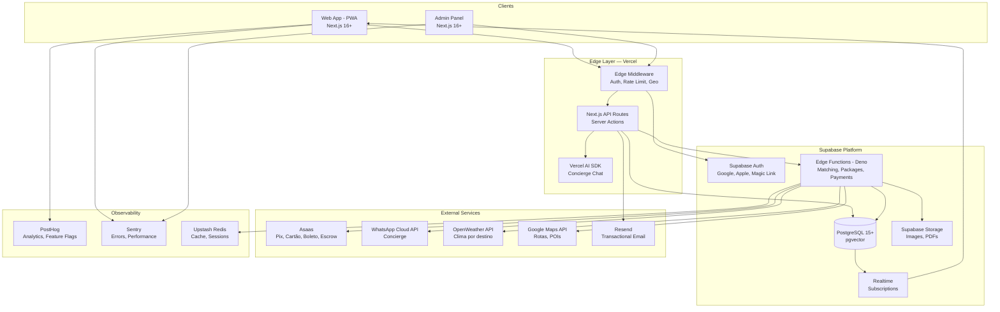
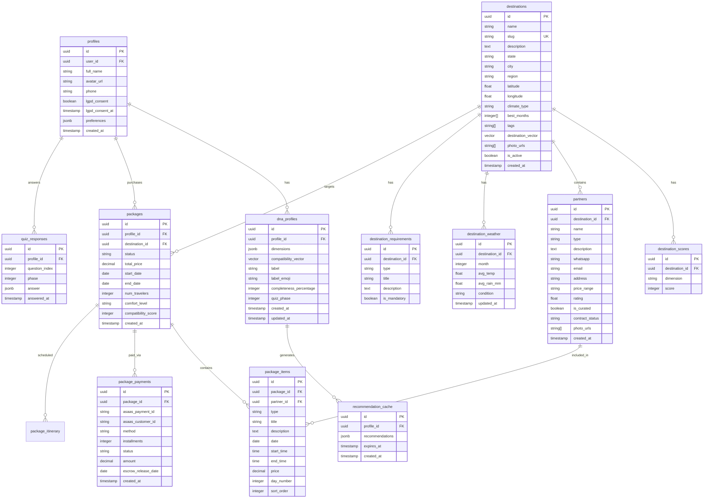
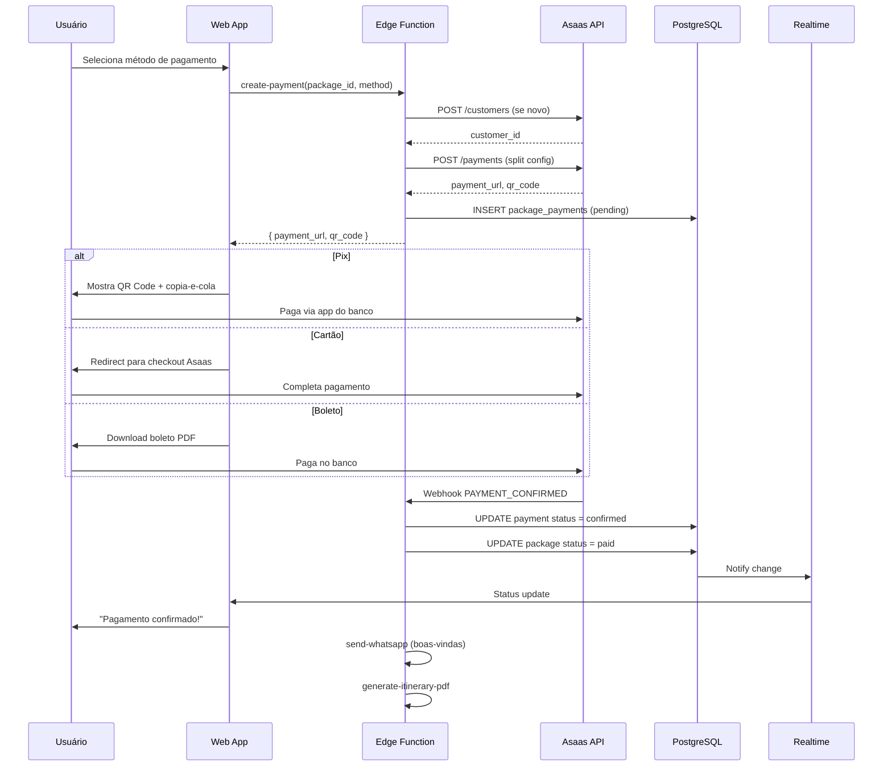
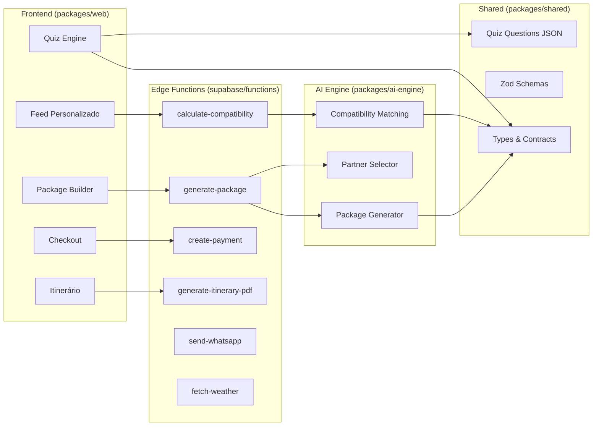
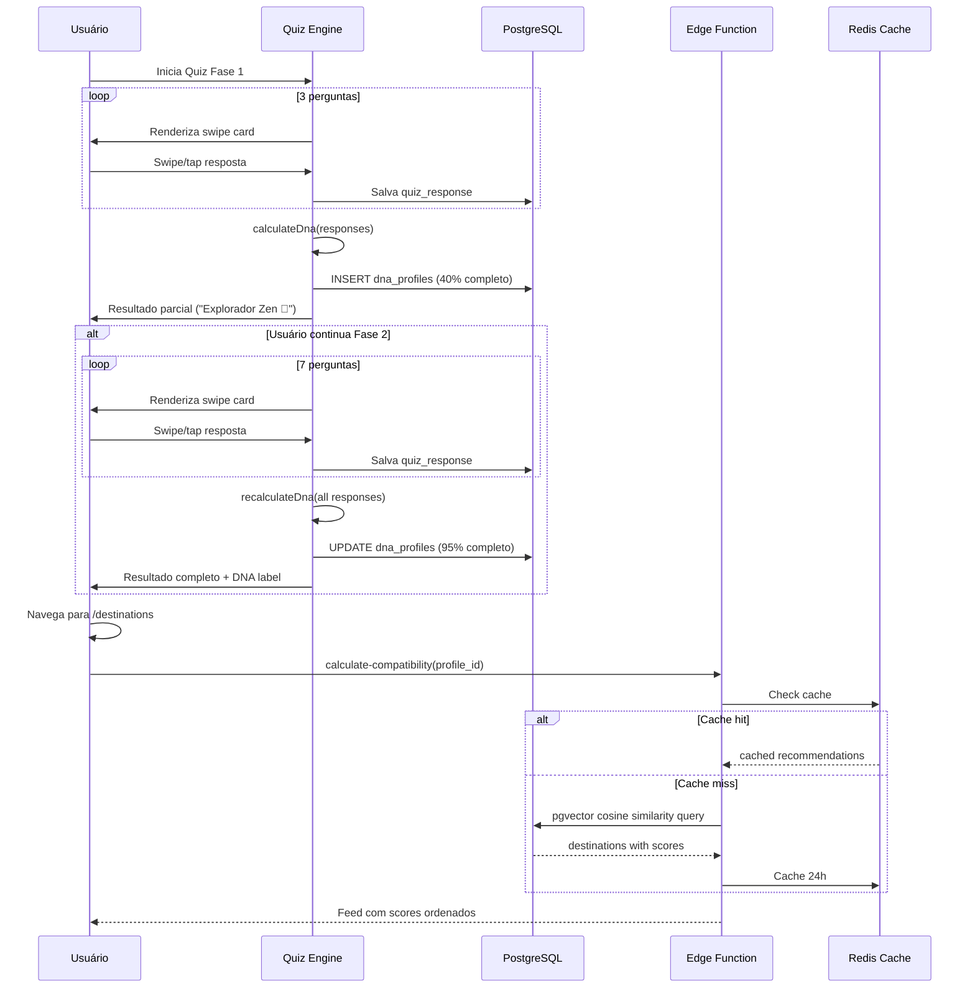
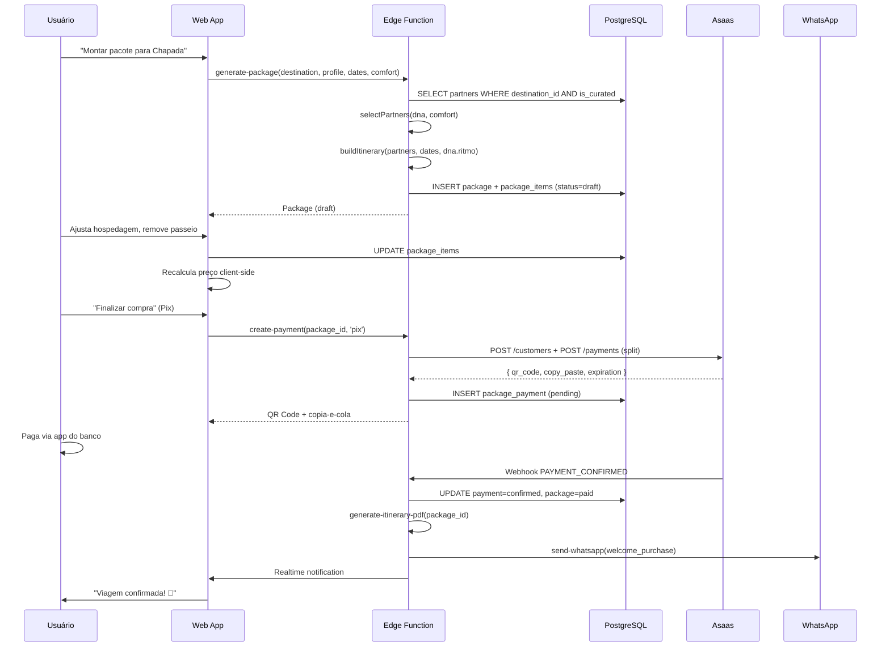
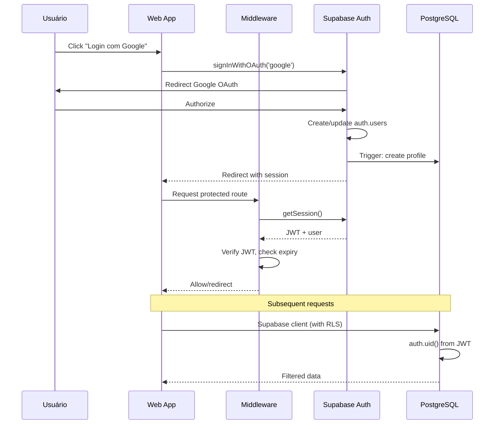

# TravelMatch BR — Fullstack Architecture Document

> Arquitetura técnica completa para a primeira plataforma brasileira de viagens com personalização baseada em DNA comportamental.

---

## Change Log

| Date | Version | Description | Author |
|------|---------|-------------|--------|
| 2026-03-09 | 1.0 | Arquitetura inicial — monorepo, Supabase, Asaas, motor pgvector | Aria (architect) |

---

## 1. Introduction

Este documento define a arquitetura fullstack do TravelMatch BR — uma plataforma de viagens personalizada que usa embedding-based matching (pgvector) para conectar perfis comportamentais de viajantes com destinos curados. Serve como fonte única de verdade para desenvolvimento AI-driven.

**Starter Template:** N/A — Greenfield project baseado no preset `nextjs-react` do AIOX Framework.

**Documentos de referência:**
- PRD: `docs/prd.md` (v1.0, 38 stories, 6 epics)
- UX Spec: `docs/ux/quiz-dna-spec.md` (Quiz DNA, Stories 1.4-1.7)

---

## 2. High Level Architecture

### 2.1 Technical Summary

TravelMatch BR é uma aplicação fullstack serverless-first construída com Next.js 16+ (App Router) em monorepo pnpm, usando Supabase como BaaS (PostgreSQL + pgvector + Auth + Edge Functions + Storage + Realtime). O motor de personalização usa vetores de 10 dimensões e similaridade cosseno via pgvector para matching DNA↔destinos. Pagamentos são processados via Asaas (gateway BR-native com Pix, cartão 12x, boleto e split/escrow). O frontend é PWA mobile-first deployado na Vercel com edge network global.

### 2.2 Platform and Infrastructure

**Platform:** Vercel + Supabase

**Key Services:**
- **Vercel** — Hosting (web + admin), Edge Middleware, Preview Deployments, Vercel AI SDK
- **Supabase** — PostgreSQL 15+ com pgvector, Auth, Edge Functions (Deno), Storage, Realtime
- **Asaas** — Pagamentos BR (Pix, cartão, boleto, split/escrow)
- **Upstash** — Redis serverless (cache, rate limiting, sessions)
- **PostHog** — Analytics, feature flags, A/B testing
- **Sentry** — Error tracking, performance monitoring

**Deployment Regions:**
- Vercel: `gru1` (São Paulo) — edge functions
- Supabase: South America (East) — `sa-east-1`
- Upstash: `sa-east-1`

### 2.3 Repository Structure

**Structure:** Monorepo com pnpm workspaces

**Monorepo Tool:** pnpm workspaces (sem Turborepo — complexidade desnecessária para 4 packages)

**Package Organization:**

| Package | Propósito | Deploy |
|---------|-----------|--------|
| `packages/web` | App público (PWA mobile-first) | Vercel (travelmatch.com.br) |
| `packages/admin` | Painel admin interno | Vercel (admin.travelmatch.com.br) |
| `packages/shared` | Types, utils, contracts, validações Zod | Lib interna |
| `packages/ai-engine` | Motor de personalização, scoring, geração de pacotes | Lib interna (consumido por Edge Functions) |

### 2.4 High Level Architecture Diagram



### 2.5 Architectural Patterns

- **Serverless-First:** Sem servidores para gerenciar. Next.js API Routes + Supabase Edge Functions escalam automaticamente. _Rationale:_ Zero DevOps, cost-per-use, auto-scaling para picos sazonais (Carnaval, Réveillon).

- **BaaS (Backend-as-a-Service):** Supabase fornece Auth, DB, Storage, Realtime, Edge Functions como serviço gerenciado. _Rationale:_ Elimina 60%+ do backend custom, acelerando MVP de 6 para 3-4 meses.

- **Embedding-Based Matching:** Perfis DNA e destinos representados como vetores de 10 dimensões, matched via similaridade cosseno (pgvector). _Rationale:_ Escalável, matematicamente preciso, melhora com mais dados (flywheel).

- **PWA Mobile-First:** Service Worker para offline, push notifications, manifest para instalação. _Rationale:_ 80%+ do tráfego de turismo é mobile; PWA evita custos de App Store.

- **Contract Pattern (shared types):** Types TypeScript e validações Zod centralizados em `packages/shared`, importados por web, admin e Edge Functions. _Rationale:_ Type-safety end-to-end, single source of truth para interfaces.

- **Edge-First Data Access:** Supabase client com RLS no frontend, Edge Functions para lógica complexa. Sem ORM — Supabase client SDK direto. _Rationale:_ Latência mínima, segurança via RLS, sem camada extra.

- **Event-Driven Payments:** Webhooks Asaas notificam status de pagamento → Edge Function processa → Supabase Realtime notifica frontend. _Rationale:_ Desacoplamento, resiliência, UX em tempo real.

---

## 3. Tech Stack

| Category | Technology | Version | Purpose | Rationale |
|----------|-----------|---------|---------|-----------|
| Frontend Language | TypeScript | 5.x | Type-safety fullstack | Preset nextjs-react, contratos compartilhados |
| Frontend Framework | Next.js | 16+ | App Router, SSR, PWA, API Routes | SSR para SEO, App Router para layouts, preset ativo |
| UI Components | shadcn/ui | latest | Componentes acessíveis | WCAG AA nativo, Radix primitives, customizável |
| CSS Framework | Tailwind CSS | 4.x | Utility-first styling | Preset ativo, design tokens via CSS variables |
| State Management | Zustand | 5.x | Global state | Leve (1kb), devtools, sem boilerplate |
| Server State | TanStack Query | 5.x | Cache, revalidation, optimistic updates | Dedup requests, stale-while-revalidate |
| Validation | Zod | 3.x | Schema validation shared | Type-safe, runtime + compile-time |
| Backend/API | Next.js API Routes + Supabase Edge Functions | — | Serverless API | Zero infra, auto-scaling |
| Database | PostgreSQL | 15+ | Dados relacionais + vetores | Supabase managed, pgvector, RLS |
| Vector Search | pgvector | 0.7+ | Similaridade cosseno DNA↔destinos | Nativo no PostgreSQL, HNSW index |
| Auth | Supabase Auth | — | Google, Apple, Magic Link | Zero código, JWT, RLS integration |
| Storage | Supabase Storage | — | Imagens, PDFs | CDN integrado, RLS |
| Realtime | Supabase Realtime | — | Subscriptions, presence | Notificações durante viagem |
| Payments | Asaas | v3 | Pix, cartão 12x, boleto, split/escrow | BR-native, ~R$240K/ano economia vs Stripe |
| Cache | Upstash Redis | — | Scores, sessions, rate limiting | Serverless, per-request pricing |
| AI Chat | Vercel AI SDK | 4.x | Streaming chat, tool calling | Concierge chatbot Tier 1 |
| Email | Resend + React Email | — | Transactional emails | React components para emails |
| WhatsApp | WhatsApp Cloud API | v20+ | Concierge Tier 2 | 1000 conversations/mês grátis |
| Maps | Google Maps API | — | Rotas, itinerário, POIs | Padrão de mercado |
| Weather | OpenWeather API | 3.0 | Clima por destino | Free tier suficiente |
| Analytics | PostHog | — | Product analytics, feature flags | Self-hosted option, LGPD compliant |
| Error Tracking | Sentry | — | Errors, performance, Web Vitals | Padrão da indústria |
| Unit Testing | Vitest | 2.x | Testes unitários + integração | Compatível com Vite, fast |
| E2E Testing | Playwright | — | Fluxos críticos | Cross-browser, PWA support |
| Component Testing | Vitest + Testing Library | — | Componentes React | React-specific matchers |
| CI/CD | GitHub Actions | — | Lint, typecheck, test, deploy | Integrado com Vercel |
| PDF Generation | @react-pdf/renderer | — | Itinerários em PDF | React components → PDF |

---

## 4. Data Models

### 4.1 Entity Relationship Diagram



### 4.2 Core TypeScript Interfaces

```typescript
// packages/shared/src/types/dna.ts

export interface DnaProfile {
  id: string;
  profileId: string;
  dimensions: DnaDimensions;
  compatibilityVector: number[]; // 10-dim vector
  label: string;
  labelEmoji: string;
  completenessPercentage: number; // 40 (phase 1) or 95+ (phase 2)
  quizPhase: 1 | 2;
  createdAt: string;
  updatedAt: string;
}

export interface DnaDimensions {
  ritmo: number;        // 0-100: zen → intenso
  natureza: number;     // 0-100: indiferente → essencial
  urbano: number;       // 0-100: evita → adora
  praia: number;        // 0-100: indiferente → essencial
  cultura: number;      // 0-100: superficial → imersivo
  gastronomia: number;  // 0-100: básico → foodie
  sociabilidade: number;// 0-100: introvertido → extrovertido
  fitness: number;      // 0-100: sedentário → atleta
  aventura: number;     // 0-100: seguro → radical
  relax: number;        // 0-100: ativo → contemplativo
}

export const DNA_DIMENSIONS = [
  'ritmo', 'natureza', 'urbano', 'praia', 'cultura',
  'gastronomia', 'sociabilidade', 'fitness', 'aventura', 'relax'
] as const;

export type DnaDimensionKey = typeof DNA_DIMENSIONS[number];
```

```typescript
// packages/shared/src/types/destination.ts

export interface Destination {
  id: string;
  name: string;
  slug: string;
  description: string;
  state: string;
  city: string;
  region: 'norte' | 'nordeste' | 'centro-oeste' | 'sudeste' | 'sul';
  latitude: number;
  longitude: number;
  climateType: string;
  bestMonths: number[];
  tags: string[];
  destinationVector: number[]; // 10-dim vector
  photoUrls: string[];
  isActive: boolean;
}

export interface DestinationWithScore extends Destination {
  compatibilityScore: number; // 0-100
  matchReasons: string[];     // "Alta compatibilidade com natureza"
}
```

```typescript
// packages/shared/src/types/package.ts

export type PackageStatus = 'draft' | 'confirmed' | 'paid' | 'active' | 'completed' | 'cancelled';
export type PackageItemType = 'transfer' | 'hospedagem' | 'passeio' | 'alimentacao' | 'seguro' | 'experiencia';
export type PaymentMethod = 'pix' | 'credit_card' | 'boleto';
export type PaymentStatus = 'pending' | 'confirmed' | 'overdue' | 'refunded' | 'cancelled';
export type ComfortLevel = 'economico' | 'conforto' | 'premium';

export interface Package {
  id: string;
  profileId: string;
  destinationId: string;
  status: PackageStatus;
  totalPrice: number;
  startDate: string;
  endDate: string;
  numTravelers: number;
  comfortLevel: ComfortLevel;
  compatibilityScore: number;
  items: PackageItem[];
  payment?: PackagePayment;
}

export interface PackageItem {
  id: string;
  packageId: string;
  partnerId: string;
  type: PackageItemType;
  title: string;
  description: string;
  date: string;
  startTime: string;
  endTime: string;
  price: number;
  dayNumber: number;
  sortOrder: number;
}

export interface PackagePayment {
  id: string;
  packageId: string;
  asaasPaymentId: string;
  method: PaymentMethod;
  installments: number;
  status: PaymentStatus;
  amount: number;
  escrowReleaseDate: string;
}
```

---

## 5. API Specification

### 5.1 API Strategy

O TravelMatch usa abordagem híbrida:
- **Next.js Server Actions** — Mutations simples (profile update, quiz save)
- **Next.js API Routes** — Endpoints REST para webhooks e integrações externas
- **Supabase Edge Functions** — Lógica pesada (matching, package generation, payments)
- **Supabase Client SDK** — Queries diretas com RLS (reads simples)

### 5.2 Edge Functions (Supabase)

| Function | Method | Input | Output | Latência |
|----------|--------|-------|--------|----------|
| `calculate-compatibility` | POST | `{ profile_id }` | `DestinationWithScore[]` | < 500ms |
| `generate-package` | POST | `{ destination_id, profile_id, dates, num_travelers, comfort_level }` | `Package` (draft) | < 3s |
| `create-payment` | POST | `{ package_id, method, installments? }` | `{ payment_url, qr_code? }` | < 2s |
| `process-payment-webhook` | POST | Asaas webhook payload | `{ status: 'processed' }` | < 1s |
| `update-dna` | POST | `{ profile_id, ratings }` | `DnaProfile` (updated) | < 1s |
| `generate-itinerary-pdf` | POST | `{ package_id }` | PDF binary | < 5s |
| `fetch-weather` | GET | `?destination_id` | `WeatherData[]` | < 2s |
| `send-whatsapp` | POST | `{ phone, template, params }` | `{ message_id }` | < 2s |

### 5.3 Next.js API Routes

```
POST /api/webhooks/asaas          — Payment status webhooks
POST /api/webhooks/whatsapp       — Incoming WhatsApp messages
GET  /api/og/dna/[userId]         — OG Image generation (Satori)
GET  /api/health                  — Health check
POST /api/chat                    — Vercel AI SDK streaming endpoint
```

### 5.4 Supabase Client (Direct with RLS)

```
profiles      — CRUD own profile
quiz_responses — CRUD own responses
dna_profiles  — READ own DNA
destinations  — READ active destinations
partners      — READ curated partners
packages      — CRUD own packages
```

---

## 6. Components

### 6.1 Motor de Personalização (ai-engine)

**Responsibility:** Calcular compatibilidade DNA↔destinos, gerar pacotes personalizados, selecionar parceiros por perfil.

**Key Interfaces:**
- `calculateCompatibility(profileId: string): Promise<DestinationWithScore[]>`
- `generatePackage(params: PackageParams): Promise<Package>`
- `selectPartners(destinationId: string, dna: DnaDimensions, comfort: ComfortLevel): Promise<Partner[]>`

**Dependencies:** pgvector (via Supabase), Upstash Redis (cache)

**Algoritmo de Matching:**

```typescript
// packages/ai-engine/src/matching.ts

import { cosineDistance } from './vector-ops';

export function calculateScore(
  dnaVector: number[],
  destinationVector: number[],
  adjustments: ScoreAdjustments
): number {
  // 1. Base score: similaridade cosseno (0-1 → 0-100)
  const baseSimilarity = 1 - cosineDistance(dnaVector, destinationVector);
  let score = baseSimilarity * 100;

  // 2. Ajuste sazonal (+5% se melhor época)
  if (adjustments.isOptimalSeason) {
    score *= 1.05;
  }

  // 3. Penalidade de budget (reduz se fora da faixa)
  if (adjustments.budgetMismatch) {
    score *= (1 - adjustments.budgetMismatch * 0.15);
  }

  // 4. Boost de completude (DNA 40% = confiança menor)
  score *= (adjustments.dnaCompleteness / 100);

  return Math.round(Math.min(100, Math.max(0, score)));
}
```

**SQL para Matching (Edge Function):**

```sql
-- Busca destinos mais compatíveis via pgvector
SELECT
  d.id,
  d.name,
  d.slug,
  d.photo_urls,
  d.tags,
  d.best_months,
  1 - (d.destination_vector <=> dp.compatibility_vector) AS cosine_similarity
FROM destinations d
CROSS JOIN dna_profiles dp
WHERE dp.profile_id = $1
  AND d.is_active = true
ORDER BY d.destination_vector <=> dp.compatibility_vector ASC
LIMIT 20;
```

### 6.2 Payment Gateway (Asaas Integration)

**Responsibility:** Processar pagamentos brasileiros (Pix, cartão, boleto), gerenciar escrow via split, webhooks de status.

**Key Interfaces:**
- `createCustomer(profile: Profile): Promise<AsaasCustomer>`
- `createPayment(params: PaymentParams): Promise<AsaasPayment>`
- `processWebhook(payload: AsaasWebhook): Promise<void>`

**Fluxo de Pagamento:**



**Asaas Split/Escrow Configuration:**

```typescript
// Split de pagamento: retenção até pós-viagem
const splitConfig = {
  walletId: TRAVELMATCH_WALLET_ID,  // Conta principal
  splits: partners.map(partner => ({
    walletId: partner.asaasWalletId,
    percentualValue: partner.splitPercentage,
    // Escrow: liberação 3 dias após fim da viagem
    dueDate: addDays(packageEndDate, 3),
  })),
  // TravelMatch markup retido automaticamente
};
```

### 6.3 Quiz Engine (Frontend)

**Responsibility:** Renderizar quiz interativo com swipe cards, calcular DNA client-side, persistir respostas server-side.

**Key Interfaces:**
- `QuizProvider` — Context provider com estado do quiz
- `useQuiz()` — Hook para controle do quiz (next, back, answer, calculate)
- `calculateDna(responses: QuizResponse[]): DnaDimensions`

**Dependencies:** Zustand (state), framer-motion (swipe), `packages/shared` (types, quiz-questions.json)

### 6.4 WhatsApp Concierge

**Responsibility:** Enviar mensagens automáticas (boas-vindas, checklist, alertas), receber mensagens do viajante, escalar para humano.

**Key Interfaces:**
- `sendTemplate(phone, templateName, params): Promise<MessageId>`
- `processIncoming(webhook): Promise<void>`

**Templates Pré-aprovados (Meta):**

| Template | Trigger | Conteúdo |
|----------|---------|----------|
| `welcome_purchase` | Pagamento confirmado | Boas-vindas + link itinerário + contato concierge |
| `pre_trip_checklist` | 7 dias antes | Checklist + documentos + previsão do tempo |
| `trip_day` | Dia da viagem | Itinerário do dia + link Maps |
| `post_trip_review` | 24h após retorno | Link para avaliação + agradecimento |

### 6.5 Component Interaction Diagram



---

## 7. External APIs

### 7.1 Asaas API

- **Purpose:** Pagamentos brasileiros — Pix, cartão (12x), boleto, split/escrow
- **Base URL:** `https://api.asaas.com/v3`
- **Auth:** API Key (header `access_token`)
- **Rate Limits:** 100 req/s (produção)

**Key Endpoints:**
- `POST /customers` — Criar cliente
- `POST /payments` — Criar cobrança (Pix/cartão/boleto)
- `GET /payments/{id}/pixQrCode` — QR Code Pix
- `POST /transfers` — Split de pagamento para parceiros
- `POST /webhooks` — Configurar webhooks

**Integration Notes:** Sandbox disponível para desenvolvimento. Split com delay requer conta tipo "Conta Digital Asaas". LGPD: dados de pagamento ficam no Asaas, não no nosso banco.

### 7.2 WhatsApp Cloud API (Meta)

- **Purpose:** Concierge via WhatsApp — mensagens automáticas e suporte
- **Base URL:** `https://graph.facebook.com/v20.0/{phone-number-id}`
- **Auth:** Bearer token (System User Access Token)
- **Rate Limits:** 1000 business-initiated conversations/mês (free tier)

**Key Endpoints:**
- `POST /messages` — Enviar mensagem/template
- Webhook endpoint para mensagens recebidas

**Integration Notes:** Templates precisam ser pré-aprovados pela Meta (~24-48h). Mensagens de resposta (customer-initiated) são gratuitas. Requer número de telefone verificado e Business Manager.

### 7.3 OpenWeather API

- **Purpose:** Dados climáticos por destino (temperatura, chuva, condição)
- **Base URL:** `https://api.openweathermap.org/data/3.0`
- **Auth:** API Key (query param `appid`)
- **Rate Limits:** 1000 calls/day (free tier)

**Key Endpoints:**
- `GET /onecall?lat={lat}&lon={lon}` — Dados atuais + 7 dias

**Integration Notes:** Cache 24h via Upstash Redis. Free tier suficiente para 20 destinos (20 calls/dia). Dados mensais históricos pré-populados em `destination_weather`.

### 7.4 Google Maps API

- **Purpose:** Mapas, rotas, POIs no itinerário
- **Auth:** API Key (restricted by domain)
- **Key APIs:** Maps JavaScript API, Directions API, Places API

**Integration Notes:** Billing required (US$200/mês free credit). Usar Static Maps para modo offline (imagens cacheadas no PWA).

### 7.5 Vercel AI SDK

- **Purpose:** Concierge chatbot IA (Tier 1) com streaming e tool calling
- **Integration:** Via `ai` package no Next.js API Route `/api/chat`
- **Model:** OpenAI GPT-4o-mini (custo/performance para chat)

**Tool Calling para Concierge:**

```typescript
// Ferramentas disponíveis para o chatbot
const tools = {
  getItinerary: { description: 'Buscar itinerário do viajante' },
  getWeather: { description: 'Clima atual no destino' },
  contactSupport: { description: 'Escalar para humano via WhatsApp' },
  findNearby: { description: 'Encontrar restaurantes/serviços próximos' },
};
```

---

## 8. Core Workflows

### 8.1 Quiz DNA → Feed Personalizado



### 8.2 Montagem de Pacote → Checkout → Confirmação



---

## 9. Database Schema

### 9.1 Extensions

```sql
-- Enable required extensions
CREATE EXTENSION IF NOT EXISTS "uuid-ossp";
CREATE EXTENSION IF NOT EXISTS "vector";    -- pgvector
CREATE EXTENSION IF NOT EXISTS "pg_trgm";   -- Text search
```

### 9.2 Core Tables

```sql
-- Profiles (extends Supabase auth.users)
CREATE TABLE profiles (
  id UUID PRIMARY KEY DEFAULT uuid_generate_v4(),
  user_id UUID REFERENCES auth.users(id) ON DELETE CASCADE NOT NULL UNIQUE,
  full_name TEXT,
  avatar_url TEXT,
  phone TEXT,
  lgpd_consent BOOLEAN DEFAULT FALSE NOT NULL,
  lgpd_consent_at TIMESTAMPTZ,
  preferences JSONB DEFAULT '{}',
  created_at TIMESTAMPTZ DEFAULT NOW() NOT NULL,
  updated_at TIMESTAMPTZ DEFAULT NOW() NOT NULL
);

-- DNA Profiles
CREATE TABLE dna_profiles (
  id UUID PRIMARY KEY DEFAULT uuid_generate_v4(),
  profile_id UUID REFERENCES profiles(id) ON DELETE CASCADE NOT NULL,
  dimensions JSONB NOT NULL,  -- { ritmo: 75, natureza: 90, ... }
  compatibility_vector VECTOR(10) NOT NULL,
  label TEXT NOT NULL,         -- "Explorador Zen"
  label_emoji TEXT DEFAULT '🌿',
  completeness_percentage INTEGER DEFAULT 40 NOT NULL,
  quiz_phase INTEGER DEFAULT 1 NOT NULL CHECK (quiz_phase IN (1, 2)),
  created_at TIMESTAMPTZ DEFAULT NOW() NOT NULL,
  updated_at TIMESTAMPTZ DEFAULT NOW() NOT NULL,
  UNIQUE(profile_id)
);

-- Quiz Responses (for resumability)
CREATE TABLE quiz_responses (
  id UUID PRIMARY KEY DEFAULT uuid_generate_v4(),
  profile_id UUID REFERENCES profiles(id) ON DELETE CASCADE NOT NULL,
  question_index INTEGER NOT NULL,
  phase INTEGER NOT NULL CHECK (phase IN (1, 2)),
  answer JSONB NOT NULL,
  answered_at TIMESTAMPTZ DEFAULT NOW() NOT NULL,
  UNIQUE(profile_id, question_index)
);

-- Destinations
CREATE TABLE destinations (
  id UUID PRIMARY KEY DEFAULT uuid_generate_v4(),
  name TEXT NOT NULL,
  slug TEXT NOT NULL UNIQUE,
  description TEXT,
  state TEXT NOT NULL,
  city TEXT NOT NULL,
  region TEXT NOT NULL CHECK (region IN ('norte', 'nordeste', 'centro-oeste', 'sudeste', 'sul')),
  latitude FLOAT NOT NULL,
  longitude FLOAT NOT NULL,
  climate_type TEXT,
  best_months INTEGER[] DEFAULT '{}',
  tags TEXT[] DEFAULT '{}',
  destination_vector VECTOR(10) NOT NULL,
  photo_urls TEXT[] DEFAULT '{}',
  is_active BOOLEAN DEFAULT FALSE NOT NULL,
  created_at TIMESTAMPTZ DEFAULT NOW() NOT NULL,
  updated_at TIMESTAMPTZ DEFAULT NOW() NOT NULL
);

-- Destination Scores (10 dimensions)
CREATE TABLE destination_scores (
  id UUID PRIMARY KEY DEFAULT uuid_generate_v4(),
  destination_id UUID REFERENCES destinations(id) ON DELETE CASCADE NOT NULL,
  dimension TEXT NOT NULL,
  score INTEGER NOT NULL CHECK (score >= 0 AND score <= 100),
  UNIQUE(destination_id, dimension)
);

-- Partners
CREATE TABLE partners (
  id UUID PRIMARY KEY DEFAULT uuid_generate_v4(),
  destination_id UUID REFERENCES destinations(id) ON DELETE CASCADE NOT NULL,
  name TEXT NOT NULL,
  type TEXT NOT NULL CHECK (type IN ('hotel', 'pousada', 'airbnb', 'guia', 'restaurante', 'transfer', 'experiencia')),
  description TEXT,
  whatsapp TEXT,
  email TEXT,
  address TEXT,
  price_range TEXT CHECK (price_range IN ('economico', 'moderado', 'premium')),
  rating FLOAT DEFAULT 0,
  is_curated BOOLEAN DEFAULT FALSE NOT NULL,
  contract_status TEXT DEFAULT 'pending' CHECK (contract_status IN ('pending', 'active', 'inactive')),
  photo_urls TEXT[] DEFAULT '{}',
  asaas_wallet_id TEXT,  -- Para split de pagamento
  split_percentage FLOAT DEFAULT 0,
  created_at TIMESTAMPTZ DEFAULT NOW() NOT NULL,
  updated_at TIMESTAMPTZ DEFAULT NOW() NOT NULL
);

-- Packages
CREATE TABLE packages (
  id UUID PRIMARY KEY DEFAULT uuid_generate_v4(),
  profile_id UUID REFERENCES profiles(id) ON DELETE CASCADE NOT NULL,
  destination_id UUID REFERENCES destinations(id) NOT NULL,
  status TEXT DEFAULT 'draft' NOT NULL
    CHECK (status IN ('draft', 'confirmed', 'paid', 'active', 'completed', 'cancelled')),
  total_price DECIMAL(10,2) NOT NULL DEFAULT 0,
  start_date DATE NOT NULL,
  end_date DATE NOT NULL,
  num_travelers INTEGER DEFAULT 1 NOT NULL,
  comfort_level TEXT DEFAULT 'conforto'
    CHECK (comfort_level IN ('economico', 'conforto', 'premium')),
  compatibility_score INTEGER DEFAULT 0,
  created_at TIMESTAMPTZ DEFAULT NOW() NOT NULL,
  updated_at TIMESTAMPTZ DEFAULT NOW() NOT NULL
);

-- Package Items
CREATE TABLE package_items (
  id UUID PRIMARY KEY DEFAULT uuid_generate_v4(),
  package_id UUID REFERENCES packages(id) ON DELETE CASCADE NOT NULL,
  partner_id UUID REFERENCES partners(id),
  type TEXT NOT NULL
    CHECK (type IN ('transfer', 'hospedagem', 'passeio', 'alimentacao', 'seguro', 'experiencia')),
  title TEXT NOT NULL,
  description TEXT,
  date DATE NOT NULL,
  start_time TIME,
  end_time TIME,
  price DECIMAL(10,2) NOT NULL DEFAULT 0,
  day_number INTEGER NOT NULL,
  sort_order INTEGER NOT NULL DEFAULT 0,
  created_at TIMESTAMPTZ DEFAULT NOW() NOT NULL
);

-- Package Payments
CREATE TABLE package_payments (
  id UUID PRIMARY KEY DEFAULT uuid_generate_v4(),
  package_id UUID REFERENCES packages(id) ON DELETE CASCADE NOT NULL,
  asaas_payment_id TEXT UNIQUE,
  asaas_customer_id TEXT,
  method TEXT NOT NULL CHECK (method IN ('pix', 'credit_card', 'boleto')),
  installments INTEGER DEFAULT 1,
  status TEXT DEFAULT 'pending' NOT NULL
    CHECK (status IN ('pending', 'confirmed', 'overdue', 'refunded', 'cancelled')),
  amount DECIMAL(10,2) NOT NULL,
  escrow_release_date DATE,
  created_at TIMESTAMPTZ DEFAULT NOW() NOT NULL,
  updated_at TIMESTAMPTZ DEFAULT NOW() NOT NULL
);

-- Weather Cache
CREATE TABLE destination_weather (
  id UUID PRIMARY KEY DEFAULT uuid_generate_v4(),
  destination_id UUID REFERENCES destinations(id) ON DELETE CASCADE NOT NULL,
  month INTEGER NOT NULL CHECK (month >= 1 AND month <= 12),
  avg_temp FLOAT,
  avg_rain_mm FLOAT,
  condition TEXT,
  updated_at TIMESTAMPTZ DEFAULT NOW() NOT NULL,
  UNIQUE(destination_id, month)
);

-- Destination Requirements
CREATE TABLE destination_requirements (
  id UUID PRIMARY KEY DEFAULT uuid_generate_v4(),
  destination_id UUID REFERENCES destinations(id) ON DELETE CASCADE NOT NULL,
  type TEXT NOT NULL CHECK (type IN ('documento', 'vacina', 'taxa', 'equipamento', 'recomendacao')),
  title TEXT NOT NULL,
  description TEXT,
  is_mandatory BOOLEAN DEFAULT FALSE NOT NULL
);

-- Recommendation Cache
CREATE TABLE recommendation_cache (
  id UUID PRIMARY KEY DEFAULT uuid_generate_v4(),
  profile_id UUID REFERENCES profiles(id) ON DELETE CASCADE NOT NULL UNIQUE,
  recommendations JSONB NOT NULL,
  expires_at TIMESTAMPTZ NOT NULL,
  created_at TIMESTAMPTZ DEFAULT NOW() NOT NULL
);
```

### 9.3 Indexes

```sql
-- Performance indexes
CREATE INDEX idx_profiles_user_id ON profiles(user_id);
CREATE INDEX idx_dna_profiles_profile_id ON dna_profiles(profile_id);
CREATE INDEX idx_quiz_responses_profile_id ON quiz_responses(profile_id);
CREATE INDEX idx_destinations_slug ON destinations(slug);
CREATE INDEX idx_destinations_active ON destinations(is_active) WHERE is_active = true;
CREATE INDEX idx_partners_destination ON partners(destination_id);
CREATE INDEX idx_partners_curated ON partners(is_curated) WHERE is_curated = true;
CREATE INDEX idx_packages_profile ON packages(profile_id);
CREATE INDEX idx_packages_status ON packages(status);
CREATE INDEX idx_package_items_package ON package_items(package_id);
CREATE INDEX idx_package_payments_package ON package_payments(package_id);
CREATE INDEX idx_package_payments_asaas ON package_payments(asaas_payment_id);
CREATE INDEX idx_recommendation_cache_expires ON recommendation_cache(expires_at);

-- pgvector HNSW indexes (fast approximate nearest neighbor)
CREATE INDEX idx_dna_vector_hnsw ON dna_profiles
  USING hnsw (compatibility_vector vector_cosine_ops)
  WITH (m = 16, ef_construction = 64);

CREATE INDEX idx_destination_vector_hnsw ON destinations
  USING hnsw (destination_vector vector_cosine_ops)
  WITH (m = 16, ef_construction = 64);
```

### 9.4 Row Level Security (RLS)

```sql
-- Enable RLS on all tables
ALTER TABLE profiles ENABLE ROW LEVEL SECURITY;
ALTER TABLE dna_profiles ENABLE ROW LEVEL SECURITY;
ALTER TABLE quiz_responses ENABLE ROW LEVEL SECURITY;
ALTER TABLE destinations ENABLE ROW LEVEL SECURITY;
ALTER TABLE partners ENABLE ROW LEVEL SECURITY;
ALTER TABLE packages ENABLE ROW LEVEL SECURITY;
ALTER TABLE package_items ENABLE ROW LEVEL SECURITY;
ALTER TABLE package_payments ENABLE ROW LEVEL SECURITY;

-- Profiles: users manage their own
CREATE POLICY "Users manage own profile" ON profiles
  FOR ALL USING (auth.uid() = user_id);

-- DNA: users read/write own
CREATE POLICY "Users manage own DNA" ON dna_profiles
  FOR ALL USING (
    profile_id IN (SELECT id FROM profiles WHERE user_id = auth.uid())
  );

-- Quiz: users manage own responses
CREATE POLICY "Users manage own quiz" ON quiz_responses
  FOR ALL USING (
    profile_id IN (SELECT id FROM profiles WHERE user_id = auth.uid())
  );

-- Destinations: everyone reads active
CREATE POLICY "Anyone reads active destinations" ON destinations
  FOR SELECT USING (is_active = true);

-- Partners: everyone reads curated
CREATE POLICY "Anyone reads curated partners" ON partners
  FOR SELECT USING (is_curated = true AND contract_status = 'active');

-- Packages: users manage own
CREATE POLICY "Users manage own packages" ON packages
  FOR ALL USING (
    profile_id IN (SELECT id FROM profiles WHERE user_id = auth.uid())
  );

-- Package items: via package ownership
CREATE POLICY "Users read own package items" ON package_items
  FOR SELECT USING (
    package_id IN (
      SELECT id FROM packages WHERE profile_id IN (
        SELECT id FROM profiles WHERE user_id = auth.uid()
      )
    )
  );

-- Payments: via package ownership
CREATE POLICY "Users read own payments" ON package_payments
  FOR SELECT USING (
    package_id IN (
      SELECT id FROM packages WHERE profile_id IN (
        SELECT id FROM profiles WHERE user_id = auth.uid()
      )
    )
  );

-- Admin policies (role-based)
CREATE POLICY "Admin full access profiles" ON profiles
  FOR ALL USING (
    auth.jwt() ->> 'role' = 'admin'
  );

CREATE POLICY "Admin full access destinations" ON destinations
  FOR ALL USING (
    auth.jwt() ->> 'role' = 'admin'
  );

CREATE POLICY "Admin full access partners" ON partners
  FOR ALL USING (
    auth.jwt() ->> 'role' = 'admin'
  );
```

---

## 10. Frontend Architecture

### 10.1 Component Organization (Atomic Design)

```
packages/web/src/
├── components/
│   ├── atoms/                    # Base components
│   │   ├── ProgressDots.tsx
│   │   ├── ProgressBar.tsx
│   │   ├── ScoreBar.tsx
│   │   ├── Badge.tsx
│   │   ├── DnaLabel.tsx
│   │   └── ui/                   # shadcn/ui components
│   ├── molecules/                # Combinations
│   │   ├── QuizCard.tsx
│   │   ├── QuizSlider.tsx
│   │   ├── QuizMultiSelect.tsx
│   │   ├── DestinationTeaser.tsx
│   │   ├── DnaRadarChart.tsx
│   │   ├── DnaScoreList.tsx
│   │   ├── ShareButton.tsx
│   │   ├── PartnerCard.tsx
│   │   ├── PackageItemCard.tsx
│   │   └── PriceBreakdown.tsx
│   ├── organisms/                # Complex sections
│   │   ├── QuizScreen.tsx
│   │   ├── DnaResultCard.tsx
│   │   ├── DnaShareSheet.tsx
│   │   ├── QuizTransition.tsx
│   │   ├── DestinationFeed.tsx
│   │   ├── PackageTimeline.tsx
│   │   ├── AccommodationCompare.tsx
│   │   ├── BudgetSimulator.tsx
│   │   └── CheckoutForm.tsx
│   └── templates/                # Page layouts
│       ├── QuizLayout.tsx
│       ├── AppLayout.tsx
│       └── AdminLayout.tsx
├── app/                          # Next.js App Router
│   ├── (auth)/
│   │   ├── login/page.tsx
│   │   └── onboarding/page.tsx
│   ├── (app)/
│   │   ├── quiz/page.tsx
│   │   ├── profile/
│   │   │   ├── page.tsx
│   │   │   └── dna/
│   │   │       ├── page.tsx
│   │   │       └── [userId]/page.tsx  # Public DNA page
│   │   ├── destinations/
│   │   │   ├── page.tsx               # Feed
│   │   │   └── [slug]/page.tsx        # Detail
│   │   ├── packages/
│   │   │   ├── [id]/page.tsx          # Package detail
│   │   │   ├── [id]/checkout/page.tsx
│   │   │   ├── [id]/checklist/page.tsx
│   │   │   └── [id]/live/page.tsx     # Active itinerary
│   │   └── chat/page.tsx              # Concierge
│   ├── api/
│   │   ├── webhooks/
│   │   │   ├── asaas/route.ts
│   │   │   └── whatsapp/route.ts
│   │   ├── og/dna/[userId]/route.tsx
│   │   ├── chat/route.ts
│   │   └── health/route.ts
│   ├── layout.tsx
│   └── page.tsx                       # Landing
├── hooks/
│   ├── useQuiz.ts
│   ├── useDna.ts
│   ├── useDestinations.ts
│   ├── usePackage.ts
│   └── useAuth.ts
├── stores/
│   ├── quiz-store.ts
│   └── app-store.ts
├── services/
│   ├── supabase/
│   │   ├── client.ts              # Browser client
│   │   ├── server.ts              # Server client
│   │   └── middleware.ts          # Auth middleware
│   ├── asaas.ts
│   └── analytics.ts
├── lib/
│   ├── utils.ts
│   └── constants.ts
└── styles/
    └── globals.css
```

### 10.2 State Management

```typescript
// stores/quiz-store.ts
import { create } from 'zustand';
import { persist } from 'zustand/middleware';

interface QuizStore {
  phase: 1 | 2;
  currentIndex: number;
  responses: Record<number, QuizAnswer>;
  dna: DnaDimensions | null;
  completeness: number;

  // Actions
  answer: (index: number, answer: QuizAnswer) => void;
  nextQuestion: () => void;
  prevQuestion: () => void;
  calculateDna: () => DnaDimensions;
  startPhase2: () => void;
  reset: () => void;
}

export const useQuizStore = create<QuizStore>()(
  persist(
    (set, get) => ({
      phase: 1,
      currentIndex: 0,
      responses: {},
      dna: null,
      completeness: 0,
      // ... implementation
    }),
    { name: 'travelmatch-quiz' } // localStorage persistence
  )
);
```

**State Patterns:**
- Server state via TanStack Query (destinations, packages, payments)
- UI state via Zustand (quiz progress, sidebar open, filters)
- Form state via React Hook Form + Zod resolver
- URL state via Next.js searchParams (filters, pagination)

### 10.3 Routing Architecture

```
/ ............................ Landing page (public)
/login ....................... Auth page (public)
/onboarding .................. Post-first-login (protected)
/quiz ........................ Quiz DNA (protected)
/profile ..................... User profile (protected)
/profile/dna ................. DNA result (protected)
/profile/dna/[userId] ........ Public DNA page (public)
/destinations ................ Feed personalizado (protected)
/destinations/[slug] ......... Destination detail (protected)
/packages/[id] ............... Package detail (protected)
/packages/[id]/checkout ...... Checkout (protected)
/packages/[id]/checklist ..... Pre-trip checklist (protected)
/packages/[id]/live .......... Active itinerary (protected)
/chat ........................ Concierge (protected)
/api/webhooks/asaas .......... Asaas webhook (API)
/api/webhooks/whatsapp ....... WhatsApp webhook (API)
/api/og/dna/[userId] ......... OG image generation (API)
/api/chat .................... AI chat endpoint (API)
/api/health .................. Health check (API)
```

**Protected Route Pattern:**

```typescript
// middleware.ts
import { createMiddlewareClient } from '@supabase/ssr';
import { NextResponse, type NextRequest } from 'next/server';

const publicRoutes = ['/', '/login', '/profile/dna/'];

export async function middleware(request: NextRequest) {
  const response = NextResponse.next();
  const supabase = createMiddlewareClient({ req: request, res: response });
  const { data: { session } } = await supabase.auth.getSession();

  const isPublicRoute = publicRoutes.some(route =>
    request.nextUrl.pathname === route ||
    request.nextUrl.pathname.startsWith('/profile/dna/')
  );

  if (!session && !isPublicRoute) {
    return NextResponse.redirect(new URL('/login', request.url));
  }

  return response;
}
```

### 10.4 Frontend Services Layer

```typescript
// services/supabase/client.ts
import { createBrowserClient } from '@supabase/ssr';
import type { Database } from '@travelmatch/shared/types/database';

export const supabase = createBrowserClient<Database>(
  process.env.NEXT_PUBLIC_SUPABASE_URL!,
  process.env.NEXT_PUBLIC_SUPABASE_ANON_KEY!
);
```

```typescript
// services/destinations.ts
import { supabase } from './supabase/client';
import type { DestinationWithScore } from '@travelmatch/shared';

export async function getPersonalizedDestinations(
  profileId: string
): Promise<DestinationWithScore[]> {
  const { data, error } = await supabase.functions.invoke(
    'calculate-compatibility',
    { body: { profile_id: profileId } }
  );

  if (error) throw error;
  return data.destinations;
}
```

---

## 11. Backend Architecture

### 11.1 Edge Functions Organization

```
supabase/functions/
├── calculate-compatibility/
│   └── index.ts          # DNA ↔ destination matching
├── generate-package/
│   └── index.ts          # Package assembly engine
├── create-payment/
│   └── index.ts          # Asaas payment creation
├── process-payment-webhook/
│   └── index.ts          # Asaas webhook handler
├── generate-itinerary-pdf/
│   └── index.ts          # PDF generation
├── fetch-weather/
│   └── index.ts          # OpenWeather integration
├── send-whatsapp/
│   └── index.ts          # WhatsApp Cloud API
├── update-dna/
│   └── index.ts          # Post-trip DNA update
└── _shared/
    ├── supabase-client.ts
    ├── asaas-client.ts
    ├── cors.ts
    └── errors.ts
```

### 11.2 Edge Function Template

```typescript
// supabase/functions/calculate-compatibility/index.ts
import { serve } from 'https://deno.land/std@0.177.0/http/server.ts';
import { createClient } from 'https://esm.sh/@supabase/supabase-js@2';
import { corsHeaders } from '../_shared/cors.ts';

serve(async (req) => {
  if (req.method === 'OPTIONS') {
    return new Response('ok', { headers: corsHeaders });
  }

  try {
    const supabase = createClient(
      Deno.env.get('SUPABASE_URL')!,
      Deno.env.get('SUPABASE_SERVICE_ROLE_KEY')!
    );

    const { profile_id } = await req.json();

    // 1. Get user DNA vector
    const { data: dna } = await supabase
      .from('dna_profiles')
      .select('compatibility_vector, completeness_percentage')
      .eq('profile_id', profile_id)
      .single();

    // 2. pgvector cosine similarity search
    const { data: destinations } = await supabase.rpc(
      'match_destinations',
      {
        query_vector: dna.compatibility_vector,
        match_count: 20,
        completeness: dna.completeness_percentage
      }
    );

    return new Response(
      JSON.stringify({ destinations }),
      { headers: { ...corsHeaders, 'Content-Type': 'application/json' } }
    );
  } catch (error) {
    return new Response(
      JSON.stringify({ error: error.message }),
      { status: 400, headers: corsHeaders }
    );
  }
});
```

### 11.3 Auth Architecture



---

## 12. Unified Project Structure

```
travelmatch/
├── .github/
│   └── workflows/
│       ├── ci.yaml                    # Lint, typecheck, test
│       ├── deploy-preview.yaml        # Vercel preview on PR
│       └── deploy-production.yaml     # Vercel production on main
├── packages/
│   ├── web/                           # Public PWA (Next.js 16+)
│   │   ├── src/
│   │   │   ├── app/                   # App Router pages
│   │   │   ├── components/            # Atomic Design (atoms/molecules/organisms/templates)
│   │   │   ├── hooks/                 # Custom React hooks
│   │   │   ├── stores/                # Zustand stores
│   │   │   ├── services/              # API clients, Supabase
│   │   │   ├── lib/                   # Utilities, constants
│   │   │   └── styles/                # Global CSS, tokens
│   │   ├── public/
│   │   │   ├── manifest.json          # PWA manifest
│   │   │   ├── sw.js                  # Service worker
│   │   │   └── icons/
│   │   ├── next.config.ts
│   │   ├── tailwind.config.ts
│   │   ├── tsconfig.json
│   │   └── package.json
│   ├── admin/                         # Admin Panel (Next.js 16+)
│   │   ├── src/
│   │   │   ├── app/
│   │   │   │   ├── dashboard/
│   │   │   │   ├── destinations/
│   │   │   │   ├── partners/
│   │   │   │   └── settings/
│   │   │   ├── components/
│   │   │   ├── hooks/
│   │   │   └── services/
│   │   ├── next.config.ts
│   │   └── package.json
│   ├── shared/                        # Shared types, utils, contracts
│   │   ├── src/
│   │   │   ├── types/
│   │   │   │   ├── database.ts        # Supabase generated types
│   │   │   │   ├── dna.ts
│   │   │   │   ├── destination.ts
│   │   │   │   ├── package.ts
│   │   │   │   └── index.ts
│   │   │   ├── schemas/               # Zod validation schemas
│   │   │   │   ├── dna.schema.ts
│   │   │   │   ├── destination.schema.ts
│   │   │   │   └── package.schema.ts
│   │   │   ├── data/
│   │   │   │   └── quiz-questions.json
│   │   │   ├── constants/
│   │   │   │   ├── dna-labels.ts
│   │   │   │   └── dna-dimensions.ts
│   │   │   └── utils/
│   │   │       ├── dna-calculator.ts
│   │   │       └── format.ts
│   │   ├── tsconfig.json
│   │   └── package.json
│   └── ai-engine/                     # Personalization engine
│       ├── src/
│       │   ├── matching.ts            # Cosine similarity scoring
│       │   ├── package-generator.ts   # Package assembly
│       │   ├── partner-selector.ts    # DNA-based partner selection
│       │   ├── vector-ops.ts          # Vector math utilities
│       │   └── index.ts
│       ├── tsconfig.json
│       └── package.json
├── supabase/
│   ├── migrations/                    # SQL migrations (ordered)
│   │   ├── 00001_extensions.sql
│   │   ├── 00002_profiles.sql
│   │   ├── 00003_dna.sql
│   │   ├── 00004_destinations.sql
│   │   ├── 00005_partners.sql
│   │   ├── 00006_packages.sql
│   │   ├── 00007_payments.sql
│   │   ├── 00008_weather.sql
│   │   ├── 00009_rls_policies.sql
│   │   ├── 00010_indexes.sql
│   │   └── 00011_functions.sql
│   ├── functions/                     # Edge Functions (Deno)
│   │   ├── calculate-compatibility/
│   │   ├── generate-package/
│   │   ├── create-payment/
│   │   ├── process-payment-webhook/
│   │   ├── generate-itinerary-pdf/
│   │   ├── fetch-weather/
│   │   ├── send-whatsapp/
│   │   ├── update-dna/
│   │   └── _shared/
│   ├── seed/
│   │   ├── destinations.sql
│   │   ├── partners.sql
│   │   └── admin-user.sql
│   └── config.toml
├── tests/
│   ├── e2e/                           # Playwright
│   │   ├── quiz-flow.spec.ts
│   │   ├── checkout-flow.spec.ts
│   │   └── playwright.config.ts
│   └── integration/
│       ├── matching.test.ts
│       ├── package-gen.test.ts
│       └── rls.test.ts
├── docs/
│   ├── prd.md
│   ├── architecture/
│   │   └── fullstack-architecture.md
│   ├── ux/
│   │   └── quiz-dna-spec.md
│   └── stories/
├── .env.example
├── .eslintrc.js
├── .prettierrc
├── pnpm-workspace.yaml
├── package.json
├── tsconfig.base.json
└── vercel.json
```

---

## 13. Development Workflow

### 13.1 Prerequisites

```bash
node --version    # >= 18.x
pnpm --version    # >= 9.x
supabase --version # >= 1.x (Supabase CLI)
```

### 13.2 Initial Setup

```bash
# Clone and install
git clone <repo-url> travelmatch
cd travelmatch
pnpm install

# Setup Supabase local
supabase init
supabase start
supabase db push    # Apply migrations

# Environment
cp .env.example .env.local
# Fill: SUPABASE_URL, SUPABASE_ANON_KEY, ASAAS_API_KEY, etc.
```

### 13.3 Development Commands

```bash
# Start all services
pnpm dev                # Starts web + admin concurrently

# Start individual packages
pnpm --filter web dev           # Web app on :3000
pnpm --filter admin dev         # Admin on :3001

# Supabase
supabase start                  # Local Supabase (DB, Auth, Storage)
supabase functions serve        # Edge Functions local
supabase db diff                # Generate migration from changes
supabase gen types typescript   # Generate TypeScript types

# Tests
pnpm test                       # All unit tests (Vitest)
pnpm test:e2e                   # Playwright E2E
pnpm test:integration           # Integration tests

# Quality
pnpm lint                       # ESLint
pnpm typecheck                  # TypeScript check
pnpm format                     # Prettier
```

### 13.4 Environment Variables

```bash
# Frontend (.env.local)
NEXT_PUBLIC_SUPABASE_URL=http://localhost:54321
NEXT_PUBLIC_SUPABASE_ANON_KEY=eyJ...
NEXT_PUBLIC_POSTHOG_KEY=phc_...
NEXT_PUBLIC_POSTHOG_HOST=https://us.i.posthog.com
NEXT_PUBLIC_SENTRY_DSN=https://...@sentry.io/...
NEXT_PUBLIC_GOOGLE_MAPS_KEY=AIza...

# Backend (Supabase Edge Functions)
SUPABASE_SERVICE_ROLE_KEY=eyJ...
ASAAS_API_KEY=...
ASAAS_WALLET_ID=...
WHATSAPP_TOKEN=...
WHATSAPP_PHONE_NUMBER_ID=...
OPENWEATHER_API_KEY=...
OPENAI_API_KEY=...        # For Vercel AI SDK
RESEND_API_KEY=re_...

# Shared
UPSTASH_REDIS_URL=...
UPSTASH_REDIS_TOKEN=...
```

---

## 14. Deployment Architecture

### 14.1 Deployment Strategy

**Frontend Deployment:**
- **Platform:** Vercel
- **Build Command:** `pnpm --filter web build` / `pnpm --filter admin build`
- **Output:** `.next/` (automatic)
- **CDN/Edge:** Vercel Edge Network (global)
- **Preview:** Automatic on every PR

**Backend Deployment:**
- **Platform:** Supabase (managed)
- **Edge Functions:** `supabase functions deploy`
- **Migrations:** `supabase db push` (via CI)

### 14.2 CI/CD Pipeline

```yaml
# .github/workflows/ci.yaml
name: CI
on: [push, pull_request]

jobs:
  quality:
    runs-on: ubuntu-latest
    steps:
      - uses: actions/checkout@v4
      - uses: pnpm/action-setup@v4
      - uses: actions/setup-node@v4
        with:
          node-version: 20
          cache: 'pnpm'
      - run: pnpm install --frozen-lockfile
      - run: pnpm lint
      - run: pnpm typecheck
      - run: pnpm test

  e2e:
    runs-on: ubuntu-latest
    needs: quality
    steps:
      - uses: actions/checkout@v4
      - uses: pnpm/action-setup@v4
      - uses: actions/setup-node@v4
      - run: pnpm install --frozen-lockfile
      - run: pnpm exec playwright install --with-deps
      - run: pnpm test:e2e
```

### 14.3 Environments

| Environment | Web URL | Admin URL | Purpose |
|-------------|---------|-----------|---------|
| Development | `localhost:3000` | `localhost:3001` | Local development |
| Preview | `pr-{n}.travelmatch.vercel.app` | — | PR review |
| Production | `travelmatch.com.br` | `admin.travelmatch.com.br` | Live |

---

## 15. Security and Performance

### 15.1 Security Requirements

**Frontend Security:**
- CSP Headers: Strict (script-src 'self', style-src 'self' 'unsafe-inline')
- XSS Prevention: React auto-escaping + CSP + sanitize-html para UGC
- Secure Storage: JWT em httpOnly cookie (Supabase SSR), dados sensíveis nunca em localStorage

**Backend Security:**
- Input Validation: Zod schemas em toda entrada (Server Actions, Edge Functions, API Routes)
- Rate Limiting: Vercel Edge Middleware (IP-based) + Upstash Redis (user-based)
- CORS: Restrictive (only travelmatch.com.br origins)
- Webhook Verification: HMAC signature para Asaas e WhatsApp webhooks

**Authentication Security:**
- Token Storage: httpOnly cookie via Supabase SSR (não localStorage)
- Session Management: JWT com refresh rotation (Supabase default)
- LGPD: Consentimento explícito, exclusão de dados, dados em região BR

**Payment Security:**
- PCI-DSS: Asaas é PCI-DSS compliant — dados de cartão nunca tocam nosso servidor
- Escrow: Split com delay automático protege viajante e parceiro
- Anti-fraude: Asaas built-in fraud detection

### 15.2 Performance Targets

**Frontend Performance:**
- Bundle Size Target: < 150KB initial JS (gzipped)
- Loading Strategy: Streaming SSR + React Suspense + dynamic imports
- Caching: ISR para destinos (revalidate 1h), SWR para dados pessoais
- Core Web Vitals: LCP < 2.5s, FID < 100ms, CLS < 0.1, Lighthouse > 90

**Backend Performance:**
- Response Time: API Routes < 200ms, Edge Functions < 500ms, Package Gen < 3s
- Database: HNSW index para pgvector (< 50ms para 20 destinos), connection pooling via Supabase
- Caching: Upstash Redis — scores (TTL 24h), sessions (TTL 7d), weather (TTL 24h)
- Auto-scaling: Vercel Edge (unlimited), Supabase (Pro plan scales to 100K+ connections)

---

## 16. Testing Strategy

### 16.1 Testing Pyramid

```
              E2E (Playwright)
             /       5 flows     \
        Integration Tests
           /    Supabase + RLS    \
      Frontend Unit   Backend Unit
        /  Components  \  /  Engine  \
       Vitest + RTL    Vitest
```

**Coverage Targets:**
- Unit: 80%+ (ai-engine, shared, utils)
- Integration: 70%+ (Edge Functions, RLS policies)
- Component: 60%+ (critical components)
- E2E: Critical flows (quiz, checkout, itinerary)

### 16.2 Test Organization

```
tests/
├── e2e/
│   ├── quiz-flow.spec.ts           # Quiz Fase 1 + 2 → DNA result
│   ├── destination-feed.spec.ts    # Feed → detail → package
│   ├── checkout-flow.spec.ts       # Package → Pix → confirmation
│   ├── auth-flow.spec.ts           # Login → onboarding → quiz
│   └── share-dna.spec.ts           # DNA → share → public page
└── integration/
    ├── matching.test.ts             # pgvector similarity
    ├── package-gen.test.ts          # Package assembly
    ├── rls.test.ts                  # RLS policies validation
    └── payment-webhook.test.ts      # Asaas webhook processing
```

### 16.3 Test Examples

```typescript
// packages/ai-engine/src/__tests__/matching.test.ts
import { describe, it, expect } from 'vitest';
import { calculateScore } from '../matching';

describe('calculateScore', () => {
  it('returns 100 for identical vectors', () => {
    const vector = [80, 90, 20, 70, 60, 50, 40, 30, 80, 70];
    const score = calculateScore(vector, vector, {
      isOptimalSeason: true,
      budgetMismatch: 0,
      dnaCompleteness: 100,
    });
    expect(score).toBeGreaterThanOrEqual(95);
  });

  it('penalizes incomplete DNA', () => {
    const dna = [80, 90, 20, 70, 60, 50, 40, 30, 80, 70];
    const dest = [80, 90, 20, 70, 60, 50, 40, 30, 80, 70];
    const fullScore = calculateScore(dna, dest, {
      isOptimalSeason: false,
      budgetMismatch: 0,
      dnaCompleteness: 100,
    });
    const partialScore = calculateScore(dna, dest, {
      isOptimalSeason: false,
      budgetMismatch: 0,
      dnaCompleteness: 40,
    });
    expect(partialScore).toBeLessThan(fullScore);
  });

  it('returns low score for opposite profiles', () => {
    const adventurer = [100, 90, 20, 30, 40, 30, 80, 90, 100, 10];
    const relaxer = [10, 30, 80, 90, 40, 70, 30, 10, 10, 100];
    const score = calculateScore(adventurer, relaxer, {
      isOptimalSeason: false,
      budgetMismatch: 0,
      dnaCompleteness: 100,
    });
    expect(score).toBeLessThan(40);
  });
});
```

```typescript
// tests/e2e/quiz-flow.spec.ts
import { test, expect } from '@playwright/test';

test('complete quiz Phase 1 and see DNA result', async ({ page }) => {
  await page.goto('/login');
  // ... auth flow ...
  await page.goto('/quiz');

  // Phase 1: 3 questions
  for (let i = 0; i < 3; i++) {
    await page.locator('[data-testid="quiz-card"]').first().click();
    await page.waitForTimeout(400); // transition
  }

  // Should see partial result
  await expect(page.locator('[data-testid="dna-label"]')).toBeVisible();
  await expect(page.locator('[data-testid="dna-radar"]')).toBeVisible();
  await expect(page.locator('text=40%')).toBeVisible();
});
```

---

## 17. Coding Standards

### 17.1 Critical Fullstack Rules

- **Type Sharing:** Sempre definir types em `packages/shared` e importar de lá. Nunca duplicar interfaces.
- **API Calls Frontend:** Usar `supabase` client SDK ou `supabase.functions.invoke()`. Nunca `fetch()` direto.
- **Environment Variables:** Acessar via `process.env.NEXT_PUBLIC_*` (frontend) ou `Deno.env.get()` (Edge Functions). Nunca hardcode.
- **Error Handling:** Toda Edge Function usa o padrão try/catch com resposta JSON `{ error: message }`. Toda Server Action retorna `{ data, error }`.
- **RLS First:** Toda tabela tem RLS. Queries do frontend dependem de RLS, não de filtros manuais.
- **Zod Validation:** Todo input de usuário validado com Zod antes de processar. Schemas em `packages/shared/schemas/`.
- **Absolute Imports:** Usar `@travelmatch/shared`, `@travelmatch/ai-engine`. Nunca `../../shared/`.

### 17.2 Naming Conventions

| Element | Frontend | Backend | Example |
|---------|----------|---------|---------|
| Components | PascalCase | — | `QuizCard.tsx` |
| Hooks | camelCase with 'use' | — | `useQuiz.ts` |
| Stores | kebab-case | — | `quiz-store.ts` |
| API Routes | — | kebab-case | `/api/webhooks/asaas` |
| Edge Functions | — | kebab-case | `calculate-compatibility` |
| DB Tables | — | snake_case | `dna_profiles` |
| DB Columns | — | snake_case | `compatibility_vector` |
| TS Interfaces | PascalCase | PascalCase | `DnaProfile` |
| Zod Schemas | camelCase + Schema | camelCase + Schema | `dnaProfileSchema` |

---

## 18. Error Handling Strategy

### 18.1 Error Response Format

```typescript
// packages/shared/src/types/error.ts
export interface ApiError {
  error: {
    code: string;          // 'PAYMENT_FAILED', 'DNA_NOT_FOUND'
    message: string;       // User-friendly pt-BR message
    details?: Record<string, unknown>;
    timestamp: string;
    requestId?: string;
  };
}

export type Result<T> = { data: T; error: null } | { data: null; error: ApiError };
```

### 18.2 Frontend Error Handling

```typescript
// services/error-handler.ts
import { toast } from 'sonner';

export function handleError(error: ApiError): void {
  const messages: Record<string, string> = {
    PAYMENT_FAILED: 'Erro no pagamento. Tente novamente.',
    DNA_NOT_FOUND: 'Complete o quiz primeiro para ver recomendações.',
    RATE_LIMITED: 'Muitas tentativas. Aguarde um momento.',
    DEFAULT: 'Algo deu errado. Tente novamente.',
  };

  toast.error(messages[error.error.code] || messages.DEFAULT);
}
```

### 18.3 Backend Error Handling

```typescript
// supabase/functions/_shared/errors.ts
export class AppError extends Error {
  constructor(
    public code: string,
    message: string,
    public status: number = 400,
    public details?: Record<string, unknown>
  ) {
    super(message);
  }
}

export function errorResponse(error: unknown): Response {
  const appError = error instanceof AppError
    ? error
    : new AppError('INTERNAL_ERROR', 'Internal server error', 500);

  return new Response(
    JSON.stringify({
      error: {
        code: appError.code,
        message: appError.message,
        details: appError.details,
        timestamp: new Date().toISOString(),
      },
    }),
    {
      status: appError.status,
      headers: { 'Content-Type': 'application/json' },
    }
  );
}
```

---

## 19. Monitoring and Observability

### 19.1 Monitoring Stack

- **Frontend Monitoring:** Vercel Analytics (Web Vitals) + PostHog (product analytics)
- **Backend Monitoring:** Supabase Dashboard (queries, connections, Edge Function logs)
- **Error Tracking:** Sentry (frontend + Edge Functions)
- **Performance Monitoring:** Vercel Speed Insights + Sentry Performance

### 19.2 Key Metrics

**Frontend Metrics:**
- Core Web Vitals (LCP, FID, CLS)
- Quiz completion rate (meta: > 70% Fase 1, > 40% Fase 2)
- Share rate (meta: > 15% dos DNA completos)
- Checkout conversion (meta: > 5% do feed)

**Backend Metrics:**
- Matching latency (target: < 500ms p95)
- Package generation time (target: < 3s p95)
- Payment success rate (target: > 95%)
- Edge Function error rate (target: < 1%)

**Business Metrics (PostHog):**
- DNA profiles created / day
- Destinations viewed / user
- Packages generated / user
- Revenue / package (average)
- NPS score

---

## 20. Checklist Results

| # | Critério | Status |
|---|----------|--------|
| 1 | Architectural patterns defined (serverless, BaaS, embedding matching) | PASS |
| 2 | Tech stack complete with versions and rationale | PASS |
| 3 | Data models with TypeScript interfaces and ER diagram | PASS |
| 4 | API specification (Edge Functions + API Routes + RLS) | PASS |
| 5 | Database schema with indexes, RLS, pgvector HNSW | PASS |
| 6 | Frontend architecture (Atomic Design, state, routing) | PASS |
| 7 | Backend architecture (Edge Functions, auth, payment flow) | PASS |
| 8 | External API integrations documented (Asaas, WhatsApp, OpenWeather, Maps) | PASS |
| 9 | Security (RLS, CSP, PCI-DSS, LGPD, webhook HMAC) | PASS |
| 10 | Performance targets with caching strategy | PASS |
| 11 | Testing strategy with examples | PASS |
| 12 | Deployment architecture (Vercel + Supabase + CI/CD) | PASS |
| 13 | Project structure (monorepo, 4 packages, Supabase functions) | PASS |
| 14 | Development workflow (commands, env vars, local setup) | PASS |
| 15 | Core workflows documented (Quiz→Feed, Package→Checkout) | PASS |

**Score: 15/15**

---

*TravelMatch BR Fullstack Architecture v1.0 — Generated by Aria (architect) via AIOX Framework*
*Date: 2026-03-09 | Based on: PRD v1.0 (38 stories) + UX Spec (Quiz DNA)*
*Preset: nextjs-react | Stack: Next.js 16+ · Supabase · Asaas · Vercel · pgvector*
